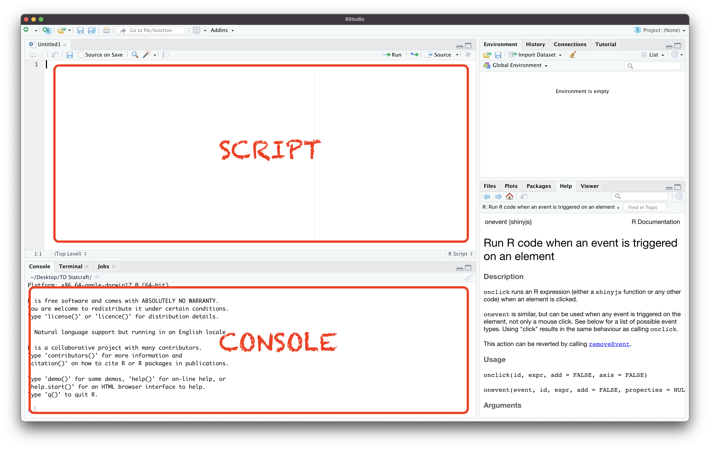

```{r setup, include=FALSE}

# Packages
library(lubridate)
library(stringi)
library(glue)
library(highcharter)
library(dplyr)

# Options
knitr::opts_chunk$set(echo = TRUE)
Sys.setlocale("LC_TIME", "fr_FR.UTF-8")

dir_data <- "."
data     <- list()

# Fonctions
explicite_date <- function(x) paste(mday(x), month(x, label=T, abbr=F), year(x))

# Layout
graphique_options <- list(title = list(align="left", style=list(fontFamily='Alegreya Sans SC')))

# Graphique
generer_graphique <- function(chart) {
  
  # Initialisation
  hc    <- highchart()
  
  # Ajout des séries
 for(serie in chart$series) {
   
   cols <- colnames(serie$data)
   x_name <- cols[1]
   y_name <- cols[2]
   
    hc <- hc_add_series(hc,
                      data=serie$data,
                      type=serie$type,
                      name=serie$name,
                      hcaes(x=!!x_name, y=!!y_name)
                    )
   
 }
      
  # Tooltip
  hc <- hc  %>%
        hc_plotOptions(
          pie = list(
            tooltip = list(
              valueSuffix="%"
            )
          )
        )

  # Title
  hc <- do.call(hc_title, c(list(hc=hc),
                             chart$title['text'],
                             graphique_options$title))

  # Colors
  if(!is.null(chart$colors)) hc <- hc %>% hc_colors(chart$colors)
  # Size
  if(!is.null(chart$size)) hc <- hc %>% hc_size(height = chart$size$height, width=chart$size$width)

  # Credits
  if(!is.null(chart$credits)) hc <- do.call(hc_credits, c(list(hc=hc), chart$credits))

  return(hc)
  
}


# Calcul des pics

calculer_pics <- function(data, 
                          seuil, 
                          color_bar="#FF0000", 
                          color_text="gray") {

mediane_mois <- data %>% group_by(month(date)) %>% summarize(vues=median(vues))
pics         <- data %>% filter(vues > (mediane_mois[month(date),]$vues)*seuil) %>% group_by(month(date)) %>% top_n(1, vues)


lines <- apply(pics, 
               MARGIN=1, 
               FUN=function(pic) {
                  
              delta <- round((as.integer(pic['vues'])*100/mediane_mois[month(pic['date']),]$vues))-100
              x_position <- match(pic['date'], data$date)
              
              list(
                label = list(text = glue("Pic du  {explicite_date(pic['date'])} (+{delta}%)*"),
                             style=list(color=color_text, fontSize="10px")),
                color = color_bar,
                width = 1,
                value = x_position
                )
            })

return(lines)

}

```

```{css, echo=FALSE}

p {
  text-align:justify;
}

h1.title {
    font-size: 48px;
    font-weight: bold;
}

h1, h2, h3, h4, h5, h6 {
  font-family:'Alegreya Sans SC'
}

.html-widget {
    margin: 20px 0;
}

/* ENCART */

.encart  {

  background: #f3fff3;
  width: 90%;
  margin: 40px auto;
  padding: 20px;
  border-radius: 20px;
  border: 3px solid #008600;
  position: relative;
  overflow:hidden;
}

.encart h3 {
  
  margin: 0 0 20px 0;
  text-align: center;
  font-size: 3rem;
  
}

.encart img {
    position: absolute;
    width: 278px;
    opacity: .07;
    top: -107px;
    left: -74px;
}

.encart img:nth-of-type(2) {
  transform:translateX(65%)
}


```

## Prérequis

+ Télécharge et installe R [lien](https://cran.r-project.org/bin/windows/base/R-4.2.0-win.exe)
+ Télécharge et installe Rstudio [lien](https://download1.rstudio.org/desktop/windows/RStudio-2022.02.3-492.exe)
+ Télécharge le zip contenant jeu de données [lien](https://github.com/thibautizard/td_statcraft/raw/main/td.zip)

## Mise en place

__Je te conseille de créer (à l'endroit qui te convient le mieux) un dossier intitulé Statcraft__ dans lequel tu mettras tous tes programmes R et tes données.

__Dézippe le fichier _zip___ que tu as téléchargé dans ce dossier Statcraft (`Clic droit` > `7zip` > `Extraire Ici`). Tu te retrouves alors avec un fichier `td.R` et un dossier `data` dont les fichiers ont tous pour extension _.rds_.

__Ouvre `td.R` en double-cliquant dessus__. Rstudio devrait se lancer et t'afficher directement le contenu du fichier.

Avant toute chose, on va __installer les packages__ qui t'aideront à manipuler tes données tout au long de ce stage. Les packages sont des extensions de R qui contiennent des fonctions spécifiques prêtes à l'emploi (ce qui nous évite surtout de devoir les inventer nous-mêmes). Pour cela, rends-toi dans la console en bas de Rstudio et tape la commande suivante :

```{r, eval=FALSE}
install.packages(dplyr)
```

Je te laisse faire de même pour les packages `data.table`, `lubridate` et `stringr`. C'est de l'apprentissage par répétition 😉

Une fois ces installations terminées, il convient de __mettre en tête de ton script l'appel à ces différents packages__ afin qu'ils soient inclus d'office dans ton programme lorsque tu l'exécuteras. Pour appeler un package, on utilise la fonction `library`. Par exemple, pour utiliser `dplyr` :

```{r, eval=FALSE}
library(dplyr)
```

Tu te demandes peut-être pourquoi j'alterne entre la console de Rstudio et le script R pour écrire ces lignes de commande ? Il faut clarifier la distinction entre ces deux espaces. Dans mon script je peux écrire et sauvegarder pour plus tard une série de commandes R. Je peux ensuite exécuter une partie ou l'intégralité de mon script. La console elle me sert à exécuter immédiatemment des lignes de code. Tout est perdu une fois Rstudio refermé ! Elle est donc utile pour débugguer nos programmes en testant certaines opérations ou pour réaliser des tâches ponctuelles qui ne reviennent pas régulièrement. Par exemple, l'installation des packages nécessaires sur ton ordinateur ne doit être faite qu'une seule fois. Il n'y aurait pas d'intérêt à les relancer à chaque fois que tu exécuteras `td.R` (sauf si tu aimes contempler ton écran en attendant). En revanche, l'appel des packages doit être réitéré à chaque fois qu'on utilise un script contenant des fonctions de ce package. C'est pour cela qu'il faut veiller à avoir une succession de `library(nom_du_package)` au commencement de son fichier si on veut pouvoir accéder à ses fonctions par la suite.

{width="100%"}

Il y a un second et dernier préalable pour partir du bon pied, c'est l'indication de ton répertoire de travail ou _working directory_. Lorsque R doit aller chercher des données sauvegardées sur notre PC, par exemple, il lui faut définir un point de départ puis les différents dossiers qu'il devra traverser pour atteindre ces données. Par défaut, lorsque j'ouvre un fichier R dans une nouvelle session Rstudio, celle-ci prend automatiquement pour _working directory_ le dossier qui contient ce fichier. Tu peux vérifier le _working directory_ de ta session en cours avec la commande suivante :

```{r}
getwd()
```

Si tu as correctement ouvert le fichier, tu devrais voir apparaître le chemin de ton _working directory_ entrecoupé de `/` et se terminant par le nom de ton dossier _Statcraft_. C'est un chemin absolu qui sera toujours identifié par opposition aux chemins relatifs plus courts à écrire mais qui nécessitent de partir du bon _working directory_. Pour éviter que d'aventure R ne se perde, il est recommandé d'inscrire au début de notre script l'adresse du _working directory_ qu'on souhaite toujours utiliser (surtout si tous nos chemins d'accès aux données seront écrits en référence à celui-ci !). Il te faut donc copier-coller ce chemin (guillemets compris) et l'insérer dans la fonction `setwd()` que tu laisseras elle toujours au début de ton script.

```{r, eval=FALSE}
setwd("mon_chemin/statcraft")
```

Voilà pour le plus pénible. On peut passer au dur de Statcraft 🙅

## Exploration des données

Nous allons commencer par importer un tableau initial simplifié de Statcraft et nous amuser à le filtrer et réaliser quelques opérations de comptage à l'aide des fonctions du package `dplyr`.

R est équipé de plusieurs fonctions d'importation des données en fonction du type de données. Ici nous allons travailler sur des données de type rds, un format compact et spécifique à R que j'ai choisi pour sauvegarder les données en sortie de batchs. Nous allons donc utiliser la fonction `readRDS` pour atteindre un des fichiers stockés dans mon dossier `data`.

Je te conseille de t'entraîner à la console avant d'écrire proprement ton code dans le script. `readRDS` prend un seul argument, le chemin complet menant au fichier .rds que je souhaite lire. Rappelle-toi que nous avons défini notre _working directory_ sur notre dossier `Statcraft` donc je peux faire débuter mon chemin en partant de ce point. Un chemin est une succession de dossier séparés par des `/`. Par exemple `dossier/sous-dossier/fichier.txt`. Le fichier que je souhaite explorer s'appelle `tableau_initial_7_janvier_2022.rds` et se trouve dans le dossier `data`. À quoi pourrait ressembler le chemin de ce fichier ? 

⚙️⚙️⚙️

Je ne te donne pas la solution 😛, tu peux tester plusieurs combinaisons dans la console jusqu'à ce qu'apparaisse un gros tableau dans celle-ci. Cela signifiera que le fichier a été trouvé et est bien lu. Mais tout cela est évanescent, sitôt le fichier appelé et affiché dans ma console qu'il est déjà reparti loin de Rstudio 😢 Pour maintenir ces données dans notre session, il faut les assigner à une variable que je pourrai ensuite invoquer et modifier à loisir. Pour assigner des données à une variable, j'utilise la flèche d'assignation `<-` (le `=` marche aussi).

```{r, eval=FALSE}
data <- readRDS("dossier/sous-dossier/fichier.txt")
```


